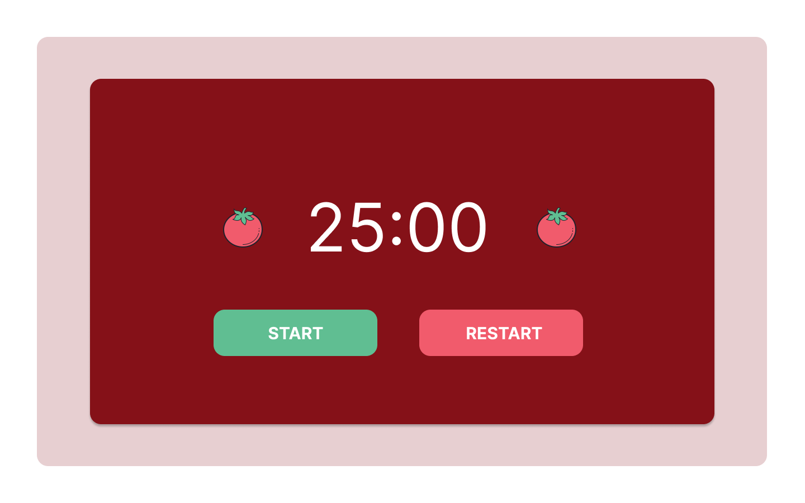

## My Process

### Design

1. To begin with, I mocked up what my design would look like using [Figma](https://www.figma.com/) (I find Figma to be more intuitive than Sketch). I went for simple design, using boxes within boxes, to practice my use of containers in HTML/ CSS.

Here's the mock-up I created on Figma:



I also decided that I wanted to include the following features:

- At the start of the 5 minute break have celebration falling from top of screen.

- At the start of the 5 minute break have the tomatoes shake and a noise made.

- When the start ‘start’ is clicked: have 'start' change to ‘pause’.

<br />
<br />

### Writing the code


2. Next up, I got all of my elements onto my page, but adding them into my HTML file.

I set the largest outer box as my main div, placing the smaller box inside it in a simple div tag, as I didn't think it required a semantic tag:

``` HTML

<body>
<div main id="outer-box" class="center">
    <div id="inner-box" class="center width-md">

```

Then, I put the countdown timer and images inside one section tag, and my two buttons inside a separate section tag:

``` HTML
<section>
    
    <h1 id=timer>25:00</h1>
    
</section>

```
``` HTML
<section>
    <button id="start-button">START</button>
    <button id="restart-button">RESTART</button>
</section>

```

Now I had all of my elements on the page:


<br />
<br />


3. I linked up my CSS file to my HTML using the below code, and started to style the page:

``` HTML
  <link rel="stylesheet" href="style.css">
  ```

I wanted to put my new CSS learnigns into practice, so focused on including center class and stack class:

``` CSS
.center {
    max-width: 90rem;
    margin-left: auto;
    margin-right: auto;
}

.width-sm {
    max-width: 40rem;
  }
```

``` CSS
.stack > * {
    margin-top: 15rem;
    margin-bottom: 15rem;
  }
```

You'll notice that I haven't used the (adjacent sibling combinator)[https://developer.mozilla.org/en-US/docs/Web/CSS/Adjacent_sibling_combinator] and that's because for this simple design, I did want space above my elements, not just between them. The **adjacent sibling combinator** means the margin you set isn't applied on top of the top element, but I wanted it to be, which is why I've used the single * to represent the element.

After using the stack class to set the margins on my page, I needed to do the same for padding, which begged the question, *can we use stack to set padding too, and if so, how do we do that if we've already used it for margins?*

We can apply multiple classes to a single element in HTML, so I decided to try and create some universal padding classes by emulating the stack class structure and apply these to the same elements, alongside our stack classes:

We add multiple classes to an element by separating the class names with a comma:

```HTML
<div main id="outer-box" class="center, stack">
```


I found writing the CSS very difficult this week, especially when put boxes inside boxes.
My main issues were around padding and margins.
In the end, I decided to leave my CSS as it was and move onto the javascript.


### Making my page talk

4. The first thing I did to approach my javascript was to write psuedo code for everything I needed to do:

```Javascript
// 1. When start button is clicked, timer to begin counting down from 25:00 to 00:00.
// 2. When timer reaches 00:00, automatically start a new countdown from 05:00 to 00:00.
// 3. When that first timer reaches 00:00, shake the tomatoes and make a noise.
// 4. When the five minute timer reaches 00:00, start a new 25:00 timer, and make a honking sound.
// 5. When the start button is clicked, change the inner text to 'pause', and vise versa when 'pause is clicked'.
// 6. When the restart button is clicked, reset the timer to the original 25:00 count.
```

I spent a long time sitting and thinking of the best order to tackle this problem in.
I knew that although I have pieces of the necessary knowledge in my head already, I'd also need to rely on the online community to get things working.

I decided that first of all, I wanted to get the countdown timer working. To create my digital clock, I used (this codewars challenge)[https://www.codewars.com/kata/52685f7382004e774f0001f7] but altered it to remove the hours part.


After sleeping on it, I went back to my counter and realised my problem:

I got my countdown working (although I still needed to add the 0 in front of single digits):
``` Javascript
function timer25Function() {
  is25ClockTicking = true;

    if(seconds > 0) {
        seconds--;
    } else if(minutes > 0 && seconds <= 0) {
        seconds = 59;
        minutes--;
    }  else if (minutes <=0 && seconds <=0) {
          clearInterval();
    }
timeRemaining.innerText = `${minutes}:${seconds}`
```

but what I wanted now was for my timer5Function to be called once this function had finished, so that the timer would start counting down from 5:00. The reason I wanted to do this, is because I want there to be continous loop between the 25:00 and 5:00 minute countdowns. If I just reset the time to be 5:00 and countdown, then at the end of that coutnodwn, I'd need to respecify 25:00 etc. The code would never end. However, I thought that if at the end of the two functions, it would point to the other one, then that loop would happen automaticall. 

### Learnings

- CSS is hard!
